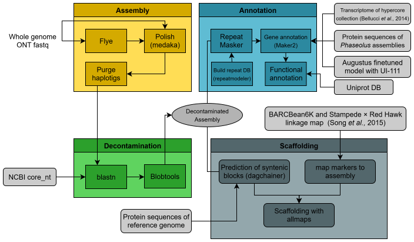

## Table of Contents
- [The Pipeline](#the-pipeline)
- [Installation](#installation)
- [Usage](#usage)
- [License](#license)

## The Pipeline


This pipeline relies on Oxford Nanopore Technologies (ONT) sequencing data to perform *de novo* genome assembly using [Flye](https://github.com/fenderglass/Flye).  
It is important to note that at least 30× coverage is required. The continuity of the resulting assembly depends largely on the $N_{50}$, which in our lab averages around 13 kb (and can be higher). For Flye, the environment requirements are specified, so Snakemake and Conda will handle this setup automatically.

The next step is polishing with [Medaka](https://github.com/nanoporetech/medaka), which uses raw reads to correct the assembly at the nucleotide level through consensus calling. The `medaka_consensus` process is computationally demanding, and using a GPU is highly recommended. Medaka depends on TensorFlow or PyTorch, which in turn depend on a compatible CUDA version. This environment must be set up manually.

After polishing, the assembly is purged to filter out allelic contigs. We expect a high level of homozygosity in the sequenced samples due to multiple selfing cycles prior to sequencing. To identify allelic contigs, we use [purge_haplotigs](https://github.com/skingan/purge_haplotigs_multiBAM), which produces a coverage histogram. From this histogram, thresholds are defined to identify diploid and haploid read coverage peaks (see the `purge_haplotigs` tutorial for details).

To remove contamination, primary (haploid) contigs are mapped against the NCBI core nucleotide database (nt) using `blastn`. Results are processed with [BlobTools](https://github.com/DRL/blobtools), and contigs with significant matches to taxa other than *Streptophyta* are filtered out.

For annotation, the process begins by building a *de novo* repeat library using [RepeatModeler](https://github.com/Dfam-consortium/RepeatModeler) with the Dfam database. Repeats are then annotated with [RepeatMasker](https://github.com/Dfam-consortium/RepeatMasker). Both tools depend on multiple external programs, and setting up their environments is tricky with Conda alone — manual installation following their official instructions is required. Once repeats are annotated, the genome is masked and gene annotation is performed with [Maker2](https://github.com/Yandell-Lab/maker).  

Evidence used for annotation includes:
- Protein sequences from seven *Phaseolus* assemblies (Labor Ovalle, G19833, UI-111, W615578, G40001, and G27455) available in [Phytozome14](https://phytozome-next.jgi.doe.gov/).  
- Transcriptomic data from four *P. vulgaris* wild accessions published by Bellucci *et al.* (2014), available under [NCBI GenBank accession GAMK00000000.1](https://www.ncbi.nlm.nih.gov/nuccore/GAMK00000000.1/).  
- An ab initio gene predictor trained with [Augustus](https://github.com/Gaius-Augustus/Augustus) using the gene annotations of UI-111.  

The final step is scaffolding with [ALLMAPS](https://github.com/tanghaibao/jcvi/wiki/ALLMAPS), which integrates linkage map data from the Stampede × Red Hawk population genotyped with BARCBean6K, together with syntenic blocks identified by [DagChainer](https://github.com/kullrich/dagchainer), and a reference specified in `config/config.yaml`.

## Usage
Once the environments for Snakemake, Medaka, RepeatModeler/RepeatMasker, and ALLMAPS are properly configured, the pipeline can be run in stages:

### Polish
Here you run the assembly and the polish with
```{shell}
snakemake -c {number_of_cores} --use-conda run_polish
```

### Coverage histogram for purge
```{shell}
snakemake -c {number_of_cores} --use-conda run_haplotig_assessment
```
### Purge
```{shell}
snakemake -c {number_of_cores} --use-conda run_purge
```
### Decontamination
```{shell}
snakemake -c {number_of_cores} --use-conda run_decontamination
```
### Repeat annotation
```{shell}
snakemake -c {number_of_cores} --use-conda run_repeats_annotation
```
### Gene annotation
```{shell}
snakemake -c {number_of_cores} --use-conda run_genes_annotation
```
### Scaffolding
```{shell}
snakemake -c {number_of_cores} --use-conda run_scaffolding
```
